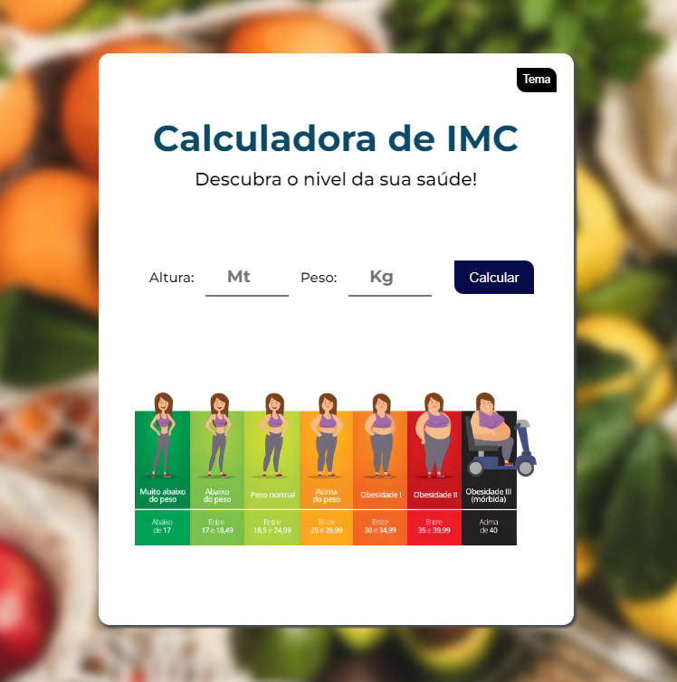
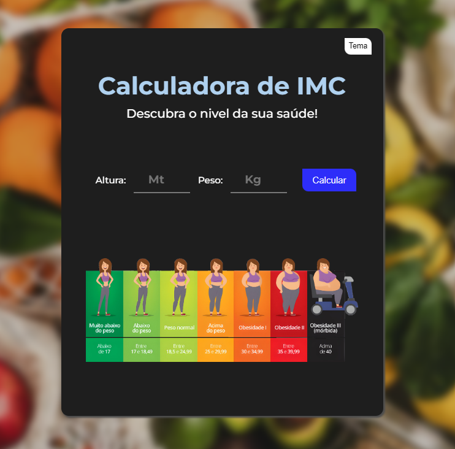

# CalculadoraIMC2

#
Mini-Projeto construído para ampliar Portfólio

[🔗​ Clique aqui para acessar](https://adrielfgs.github.io/CalculadoraIMC2/)

## ⚒️​ Tecnologias

- HTML
- CSS
- JS
- Git e Github

## ⚡​​ ​Contato

adrielgalvao.fernandes@gmail.com
